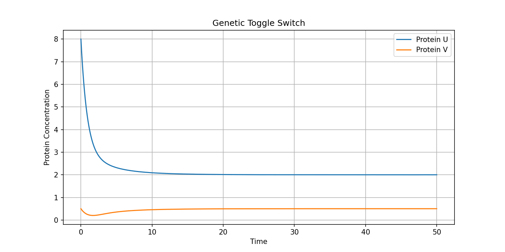
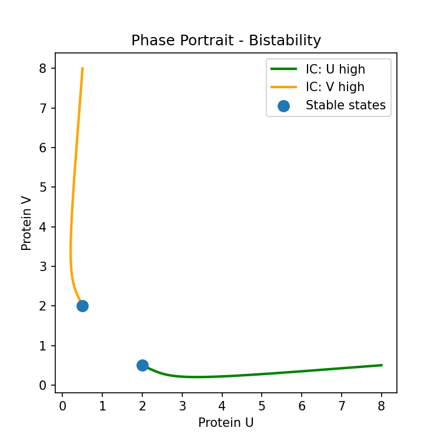

# genetic-toggle-switch-simulation
computational model of gardner et al.2000 genetic toggle switch using python ODEs. added music so i dont lose my mind while debugging. 
Gv# Genetic Toggle Switch Simulation
**Computational Biology | Python | SciPy | Matplotlib**

A simulation of the bistable genetic toggle switch based on 
Gardner et al. (2000, Nature) using ordinary differential equations.

## What is a Toggle Switch?
Two genes mutually repress each other and  whoever starts stronger, 
wins and stays dominant. This is called bistability.

## The Math
du/dt = α₁/(1+v^β) - u

dv/dt = α₂/(1+u^γ) - v

## Results
### Time Series

### Phase Portrait

## How to Run
pip install numpy matplotlib scipy ipywidgets

Run toggle_switch.py or open the .ipynb notebook in Jupyter/VS Code

## Reference
Gardner, T.S., Cantor, C.R., Collins, J.J. (2000). 
Construction of a genetic toggle switch in Escherichia coli. 
Nature, 403, 339–342.
